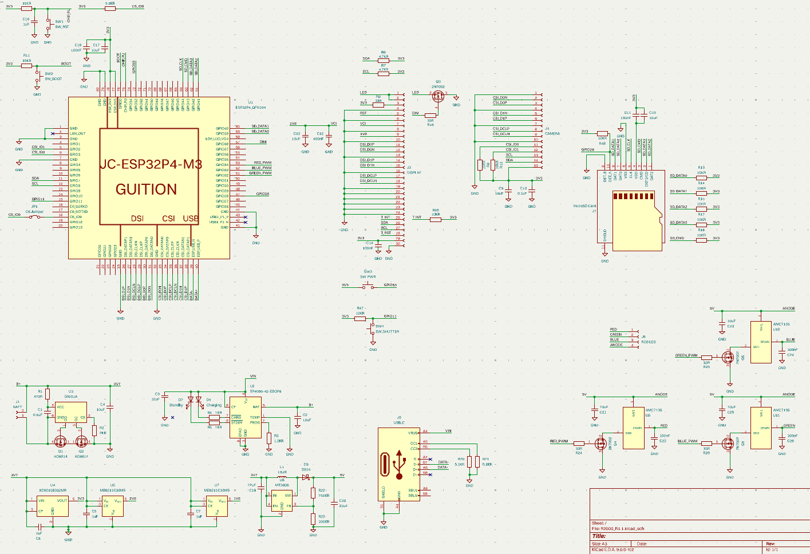
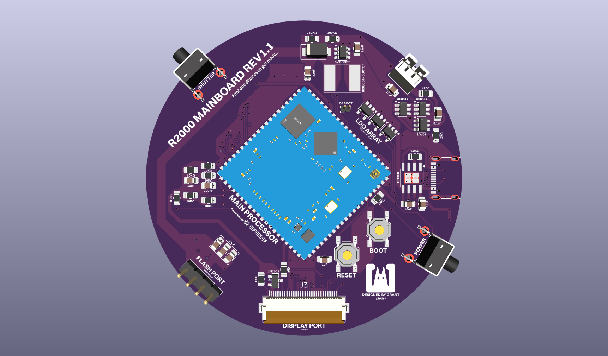

# R2000

> A compact, round-bodied digital camera built around the ESP32-P4, designed for fun, accessible photography with a deliberate film-inspired aesthetic.


---

## Overview

The R2000 is a hand-held digital camera on an 80mm circular PCB. Fixed-focus wide-angle lens, film-style filters, RGB flash, and a round touchscreen — all driven by an ESP32-P4 + ESP32-C6 SOM. It's a camera that prioritises feel and fun over clinical image quality.

---

## Features

- **80mm round PCB** — compact, pocketable form factor
- **OV5640 MIPI CSI-2 sensor** — 5MP, fixed focus, wide angle (~1.5m hyperfocal)
- **2.1" round ST7701S touchscreen** — live viewfinder and menu UI via LVGL
- **3-channel RGB flash** — independent R/G/B control for software-adjustable colour temperature
- **Film aesthetic filters** — colour grading, grain, vignette, and light leak applied in-camera
- **microSD card storage** — JPEG capture written directly from hardware encoder
- **USB-C** — charging and file transfer
- **1000mAh LiPo** — onboard single-cell battery

---

## Hardware

### Core SOM

**Guition JC-ESP32P4-M3-C6** — a dual-chip SOM combining:
- **ESP32-P4** — main application processor, MIPI CSI camera input, RGB display output, hardware JPEG encode, SD/MMC
- **ESP32-C6** — WiFi 6 / BLE 5 radio for wireless transfer and future remote control

### Schematic



### PCB



| Parameter | Value |
|-----------|-------|
| Shape | Circular |
| Diameter | 80mm |
| Layers | 4 |
| Design tool | KiCad |

- LDO bank placed adjacent to OV5640 to keep power traces short
- MT3608 boost converter isolated from camera rails to reduce switching noise
- RGB panel interface traces serpentined for length matching
- SD card traces kept short with 10kΩ pull-ups on CMD and DAT lines

### Camera

| Parameter | Value |
|-----------|-------|
| Sensor | OV5640 |
| Interface | MIPI CSI-2 (2-lane) |
| Resolution | 5MP (2592×1944) |
| Focus | Fixed, wide angle |
| Hyperfocal | ~1.5m (everything from ~80cm to ∞ sharp) |
| Autofocus | None — VCM unused |

### Display

| Parameter | Value |
|-----------|-------|
| Driver IC | ST7701S |
| Size | 2.1" round |
| Diameter | ~54mm |
| Interface | RGB parallel |
| Touch IC | GT911 (I2C) |

### Flash

Three independent channels let you tune the colour temperature of each shot in software — or go full auto white-balance assist by sampling the scene before firing.

| Channel | Driver | Supply |
|---------|--------|--------|
| Red 1W LED | AMC7135 (350mA CC) | 5V (MT3608 boost) |
| Green 1W LED | AMC7135 (350mA CC) | 5V (MT3608 boost) |
| Blue 1W LED | AMC7135 (350mA CC) | 5V (MT3608 boost) |

### Power

| Rail | Regulator | Supplies |
|------|-----------|---------|
| 3.3V | XC6210B332 (1A) | SOM, display logic, SD, GT911 |
| 2.8V | ME6211C28 (600mA) | OV5640 AVDD |
| 1.8V | ME6211C18 (600mA) | OV5640 DOVDD |
| 1.5V | ME6211C15 (600mA) | OV5640 DVDD |
| 5V (flash) | MT3608 boost | RGB flash rail |

Battery: 1000mAh single-cell LiPo, ~503040 form factor, charged via TP5100.

---

## Firmware

### Stack

| Layer | Component |
|-------|-----------|
| RTOS | FreeRTOS (via ESP-IDF v5.3+) |
| Camera | `esp_cam_sensor` + `esp_video` (MIPI CSI DMA) |
| JPEG encode | `esp_jpeg` — hardware-accelerated on ESP32-P4 |
| Display | `esp_lcd` (ST7701S) + `esp_lcd_touch` (GT911) |
| UI | LVGL — hardware-accelerated via P4 PPA |
| Storage | `esp_vfs_fat` + `sdmmc` |

### Task Architecture

```
Core 0                         Core 1
├── Camera capture task        ├── LVGL UI task
├── JPEG encode task           └── Touch polling task
└── SD write task
```

Both cores run in genuine parallel — the live viewfinder never stutters during a write.

### Capture Pipeline

```
OV5640 sensor
  └── MIPI CSI-2 DMA → PSRAM framebuffer
        └── HW JPEG encoder
              └── SD write (FAT32)
                    └── JPEG file
```

### Filters

- **Colour grading** — warm/cool/cross-process presets
- **Grain simulation** — luminance-dependent noise overlay
- **Vignette** — radial falloff, adjustable intensity
- **Light leak** — randomised edge flare, optional per-shot

---

## Getting Started

### Prerequisites

- ESP-IDF v5.3 or later ([installation guide](https://docs.espressif.com/projects/esp-idf/en/latest/esp32p4/get-started/))
- KiCad 8.x for hardware files

### Build Firmware

```bash
git clone https://github.com/yourusername/R2000.git
cd R2000/firmware

idf.py set-target esp32p4
idf.py menuconfig     # Set SD card GPIO, display config, etc.
idf.py build
idf.py -p /dev/ttyUSBx flash monitor
```

### Hardware Assembly

1. Order PCB from JLCPCB using files in `hardware/pcb/`
2. Source components from `hardware/bom/` — LCSC preferred for basic parts
3. Flash firmware before installing display and camera to simplify debug access

---

## GPIO Map

See [`docs/gpio_map.md`](docs/gpio_map.md) for the full 30-pin assignment covering RGB display, GT911 touch, OV5640 MIPI/I2C/XCLK, SD card, flash channels, and shutter button.

---

## Design Philosophy

The R2000 isn't trying to be a precise instrument. No AF hunting, no deep menus, no lab-grade colour science. Wide angle and fixed focus means everything is sharp the moment you raise it. The filters are baked in, not bolted on. Round is unusual and that's the point.

If you want clinical accuracy, this is the wrong camera. If you want something that makes you actually want to take pictures, that's what this is for.

---

## Status

| Subsystem | Status |
|-----------|--------|
| PCB layout | ✅ First pass complete |
| Power system | ✅ LDO selection finalised |
| Camera capture | 🔧 In progress |
| Display / LVGL | 🔧 In progress |
| RGB flash driver | ⬜ Not started |
| Film filters | ⬜ Not started |
| SD storage | ⬜ Not started |
| WiFi upload (C6) | ⬜ Not started |

---

## License

Hardware and firmware released under [MIT License](LICENSE).
